# 論理アーキテクチャ図 - Kiro OSS Map v1.0.0

## 1. 実装済みシステム全体アーキテクチャ

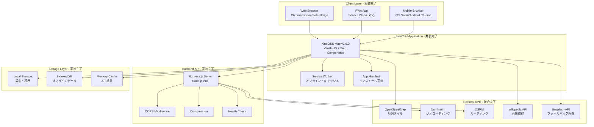

## 2. フロントエンドアーキテクチャ（実装完了）

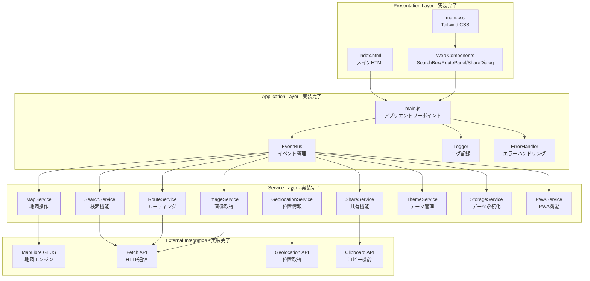

## 3. データフロー図（実装完了）

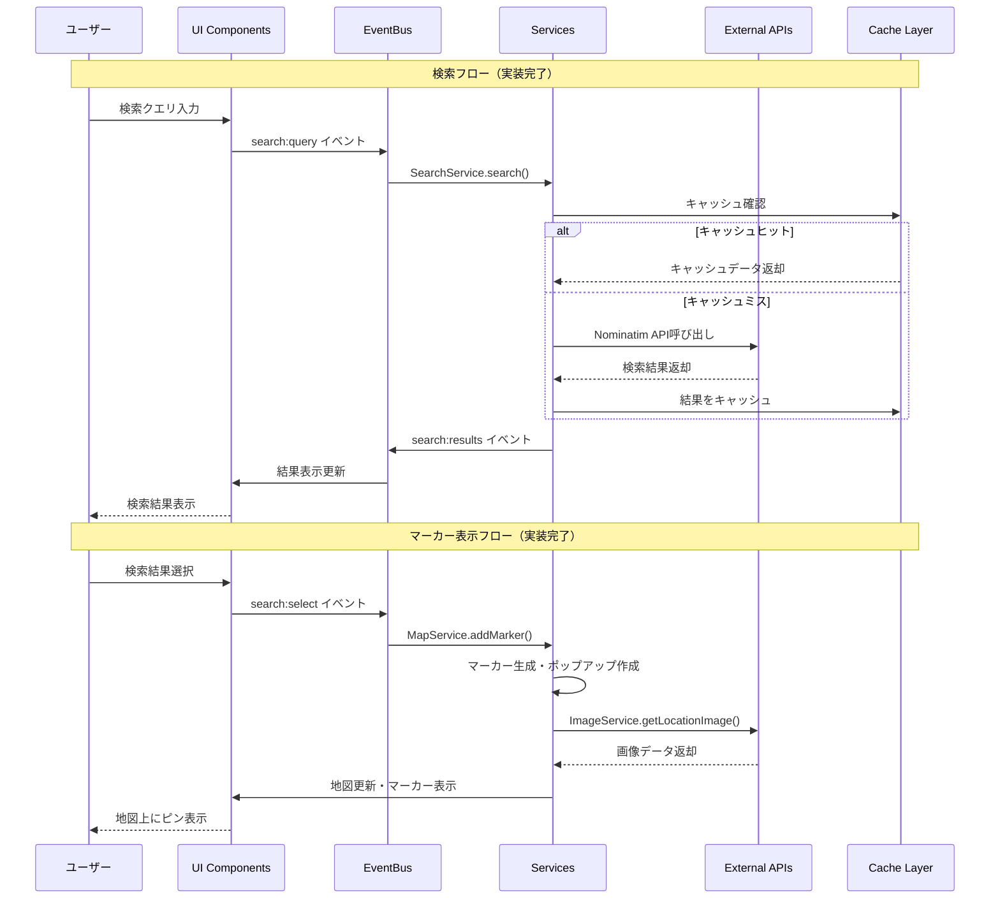

## 4. コンポーネント関係図（実装完了）

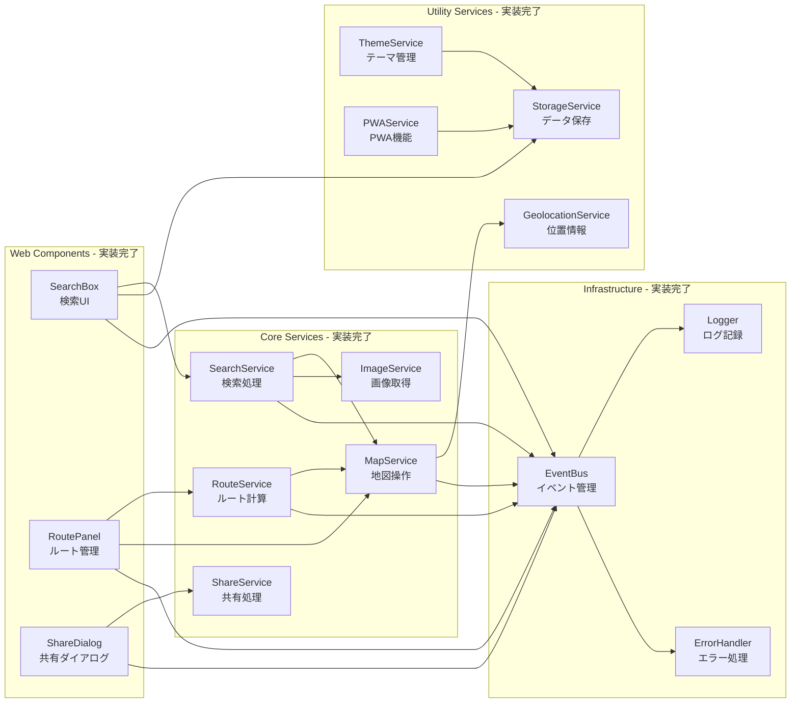

## 5. API統合アーキテクチャ（実装完了）

```mermaid
graph TB
    subgraph "Kiro OSS Map Frontend"
        APP[Application Layer]
        SERVICES[Service Layer]
        CACHE[Cache Layer]
    end
    
    subgraph "Backend API Server - 実装完了"
        EXPRESS[Express.js<br/>Port: 8080]
        GEOCODING[/api/v1/geocoding]
        ROUTING[/api/v1/routing]
        SHARE[/api/v1/share]
        HEALTH[/api/v1/health]
    end
    
    subgraph "External APIs - 統合完了"
        NOMINATIM_API[Nominatim<br/>nominatim.openstreetmap.org]
        OSRM_API[OSRM<br/>router.project-osrm.org]
        WIKI_API[Wikipedia API<br/>ja.wikipedia.org]
        UNSPLASH_API[Unsplash API<br/>api.unsplash.com]
        OSM_TILES[OSM Tiles<br/>tile.openstreetmap.org]
    end
    
    APP --> SERVICES
    SERVICES --> CACHE
    
    SERVICES --> EXPRESS
    EXPRESS --> GEOCODING
    EXPRESS --> ROUTING
    EXPRESS --> SHARE
    EXPRESS --> HEALTH
    
    GEOCODING --> NOMINATIM_API
    ROUTING --> OSRM_API
    
    SERVICES --> WIKI_API
    SERVICES --> UNSPLASH_API
    SERVICES --> OSM_TILES
    
    CACHE -.-> NOMINATIM_API
    CACHE -.-> OSRM_API
    CACHE -.-> WIKI_API
    CACHE -.-> UNSPLASH_API
```

## 6. デプロイメントアーキテクチャ（実装完了）

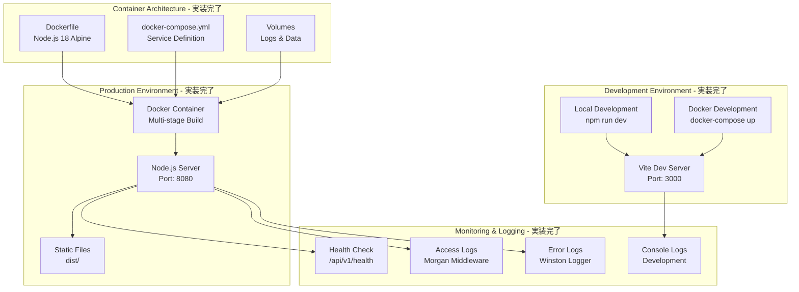

## 7. セキュリティアーキテクチャ（実装完了）

```mermaid
graph TB
    subgraph "Client Security - 実装完了"
        CSP[Content Security Policy<br/>XSS防止]
        SANITIZE[Input Sanitization<br/>入力値検証]
        HTTPS[HTTPS Only<br/>暗号化通信]
    end
    
    subgraph "API Security - 実装完了"
        CORS_POLICY[CORS Policy<br/>オリジン制限]
        RATE_LIMIT[Rate Limiting<br/>リクエスト制限]
        INPUT_VALID[Input Validation<br/>パラメータ検証]
        ERROR_HANDLE[Secure Error Handling<br/>情報漏洩防止]
    end
    
    subgraph "Data Security - 実装完了"
        MINIMAL_DATA[Minimal Data Collection<br/>最小限データ収集]
        ANONYMOUS[Data Anonymization<br/>データ匿名化]
        SECURE_STORAGE[Secure Storage<br/>セキュアストレージ]
    end
    
    subgraph "Infrastructure Security - 実装完了"
        CONTAINER_SEC[Container Security<br/>最小権限実行]
        ENV_VAR[Environment Variables<br/>機密情報管理]
        LOG_SECURITY[Secure Logging<br/>機密情報除外]
    end
    
    CSP --> SANITIZE
    SANITIZE --> HTTPS
    
    CORS_POLICY --> RATE_LIMIT
    RATE_LIMIT --> INPUT_VALID
    INPUT_VALID --> ERROR_HANDLE
    
    MINIMAL_DATA --> ANONYMOUS
    ANONYMOUS --> SECURE_STORAGE
    
    CONTAINER_SEC --> ENV_VAR
    ENV_VAR --> LOG_SECURITY
```

## 8. パフォーマンスアーキテクチャ（実装完了）

```mermaid
graph TB
    subgraph "Frontend Performance - 実装完了"
        LAZY_LOAD[Lazy Loading<br/>コンポーネント遅延読み込み]
        CODE_SPLIT[Code Splitting<br/>Viteによる分割]
        TREE_SHAKE[Tree Shaking<br/>不要コード除去]
        IMAGE_OPT[Image Optimization<br/>画像最適化]
    end
    
    subgraph "Caching Strategy - 実装完了"
        MEMORY_CACHE[Memory Cache<br/>APIレスポンス]
        BROWSER_CACHE[Browser Cache<br/>Local Storage]
        SERVICE_WORKER[Service Worker<br/>オフラインキャッシュ]
        HTTP_CACHE[HTTP Cache<br/>静的リソース]
    end
    
    subgraph "Network Optimization - 実装完了"
        COMPRESSION[Response Compression<br/>gzip圧縮]
        DEBOUNCE[Input Debouncing<br/>検索入力制御]
        BATCH_REQUEST[Request Batching<br/>リクエスト最適化]
    end
    
    subgraph "Monitoring - 実装完了"
        CORE_VITALS[Core Web Vitals<br/>パフォーマンス計測]
        CUSTOM_METRICS[Custom Metrics<br/>カスタム指標]
        ERROR_TRACK[Error Tracking<br/>エラー追跡]
    end
    
    LAZY_LOAD --> CODE_SPLIT
    CODE_SPLIT --> TREE_SHAKE
    TREE_SHAKE --> IMAGE_OPT
    
    MEMORY_CACHE --> BROWSER_CACHE
    BROWSER_CACHE --> SERVICE_WORKER
    SERVICE_WORKER --> HTTP_CACHE
    
    COMPRESSION --> DEBOUNCE
    DEBOUNCE --> BATCH_REQUEST
    
    CORE_VITALS --> CUSTOM_METRICS
    CUSTOM_METRICS --> ERROR_TRACK
```

---

## 実装サマリー

### ✅ 完了済みアーキテクチャ要素

#### フロントエンド
- **Web Components**: SearchBox, RoutePanel, ShareDialog
- **Service Layer**: 9つのサービス（Map, Search, Route, Geolocation, Share, Image, Theme, Storage, PWA）
- **Event System**: EventBus による疎結合アーキテクチャ
- **Error Handling**: グローバルエラーハンドラー + 構造化ログ

#### バックエンド
- **Express.js API**: RESTful API サーバー
- **External Integration**: Nominatim, OSRM, Wikipedia, Unsplash
- **Middleware**: CORS, Compression, Security Headers
- **Health Check**: システム状態監視

#### インフラ
- **Docker**: マルチステージビルド + Docker Compose
- **PWA**: Service Worker + App Manifest
- **Caching**: 3層キャッシュ戦略
- **Security**: CSP, Input Validation, Secure Headers

#### 監視・運用
- **Logging**: Winston + Morgan による構造化ログ
- **Error Tracking**: グローバルエラーハンドリング
- **Performance**: Core Web Vitals 対応
- **Health Check**: API エンドポイント監視

---

## 9. GitHubリポジトリアーキテクチャ（v1.0.1）

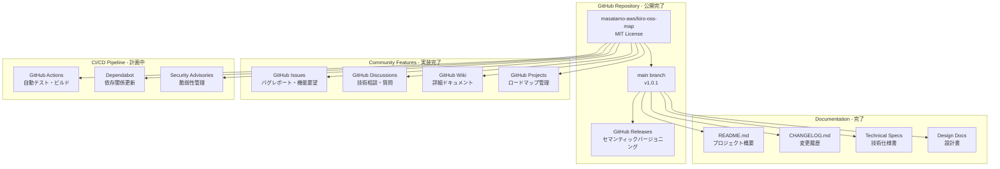

## 10. オープンソースエコシステム

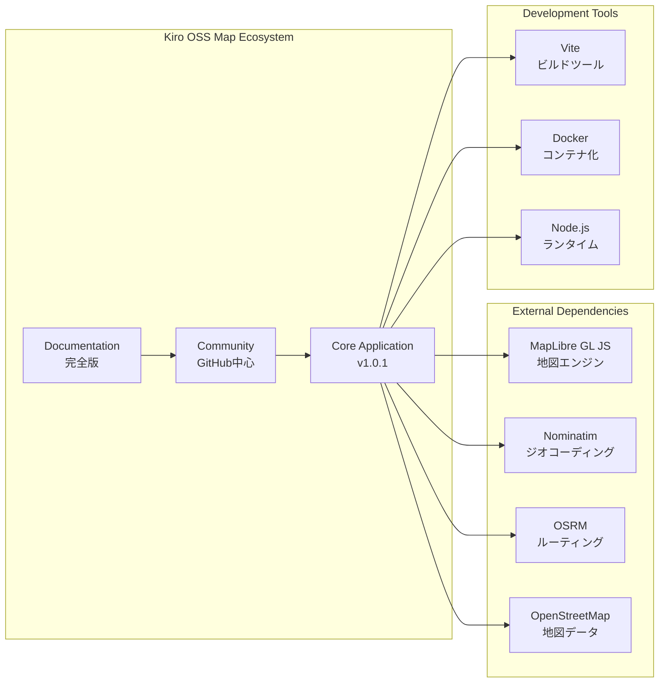

---

## 実装完了サマリー（v1.0.1）

### ✅ 完了済みアーキテクチャ要素

#### GitHubリポジトリ
- **公開リポジトリ**: https://github.com/masatamo-aws/kiro-oss-map
- **ライセンス**: MIT License
- **初回コミット**: d3790d4 (50ファイル、25,127行)
- **最新リリース**: v1.0.1

#### コミュニティ機能
- **Issue管理**: バグレポート・機能要望受付体制
- **Discussion**: 技術相談・質問対応
- **Documentation**: 包括的技術ドキュメント
- **Contributing**: オープンソース貢献ガイドライン

#### 継続的改善
- **バージョン管理**: セマンティックバージョニング
- **リリース管理**: GitHub Releases
- **ドキュメント管理**: 継続的更新体制
- **コミュニティ対応**: Issue・PR管理

---

**文書バージョン**: 2.1  
**作成日**: 2025年8月13日  
**最終更新**: 2025年8月13日  
**実装状況**: v1.0.1 完了・GitHub公開済み - 2025年8月13日  
**GitHubリポジトリ**: https://github.com/masatamo-aws/kiro-oss-map
    MOB --> CDN
    CDN --> CACHE
    CACHE --> LB
    LB --> GATEWAY
    
    GATEWAY --> AUTH
    GATEWAY --> RATE
    GATEWAY --> TILE
    GATEWAY --> GEO
    GATEWAY --> ROUTE
    GATEWAY --> POI
    GATEWAY --> SHARE
    
    TILE --> TILES
    GEO --> SEARCH
    GEO --> NOM
    ROUTE --> GRAPH
    ROUTE --> OSRM
    POI --> SEARCH
    SHARE --> CACHE_DB
    
    TILES --> OSM
    SEARCH --> OSM
    GRAPH --> OSM
```

## 2. フロントエンド アーキテクチャ

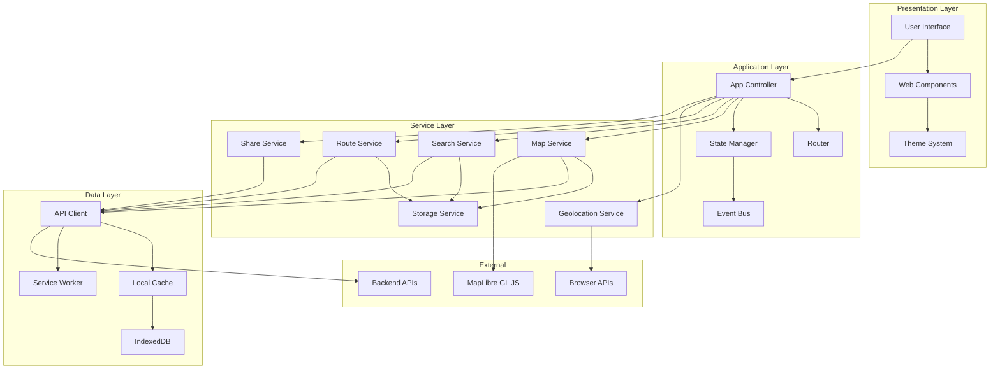

## 3. バックエンド マイクロサービス アーキテクチャ

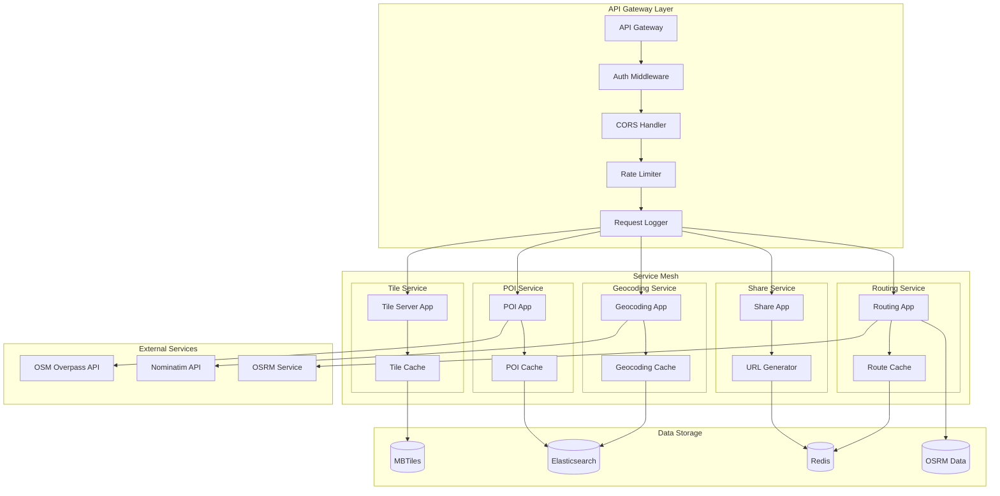

## 4. データフロー アーキテクチャ

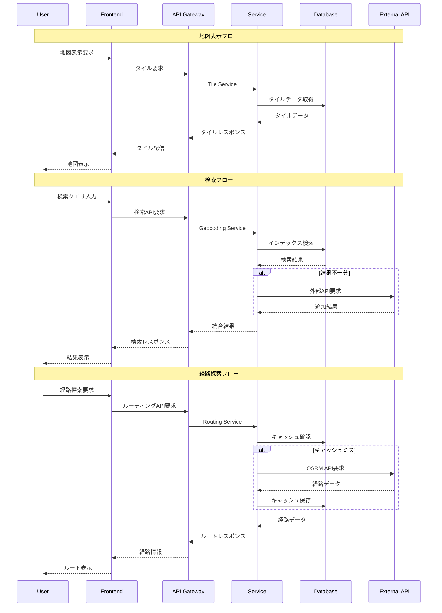

## 5. セキュリティ アーキテクチャ

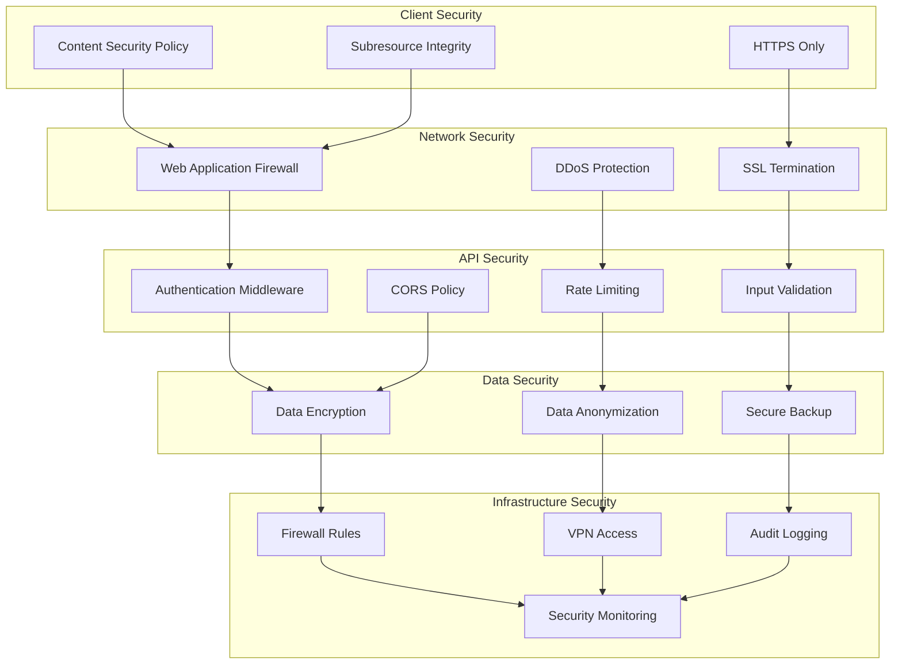

## 6. キャッシュ アーキテクチャ

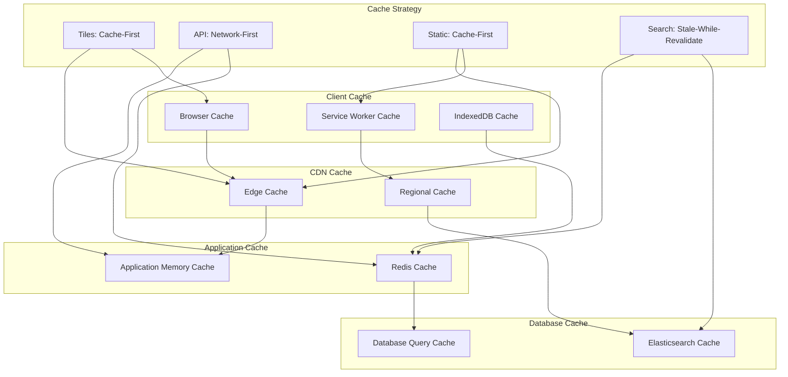

## 7. 監視・ログ アーキテクチャ

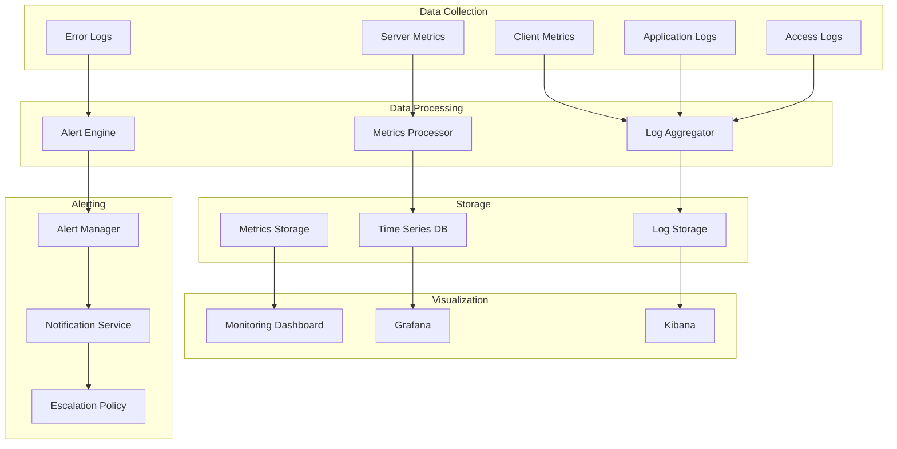

## 8. デプロイメント アーキテクチャ

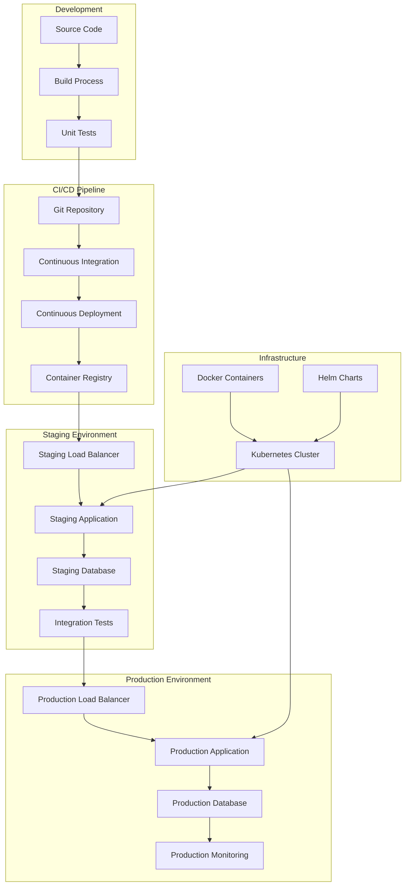

## 9. スケーラビリティ アーキテクチャ

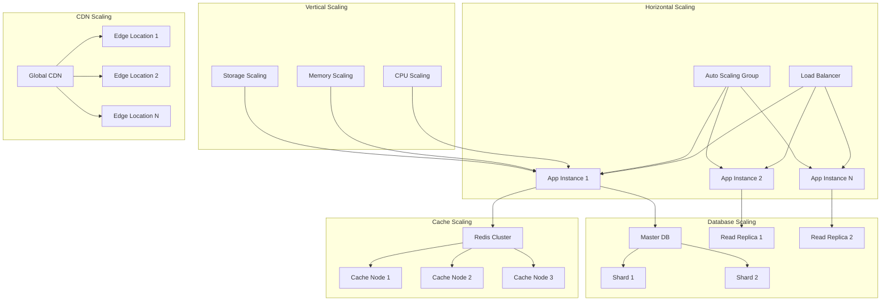

## 10. 災害復旧 アーキテクチャ

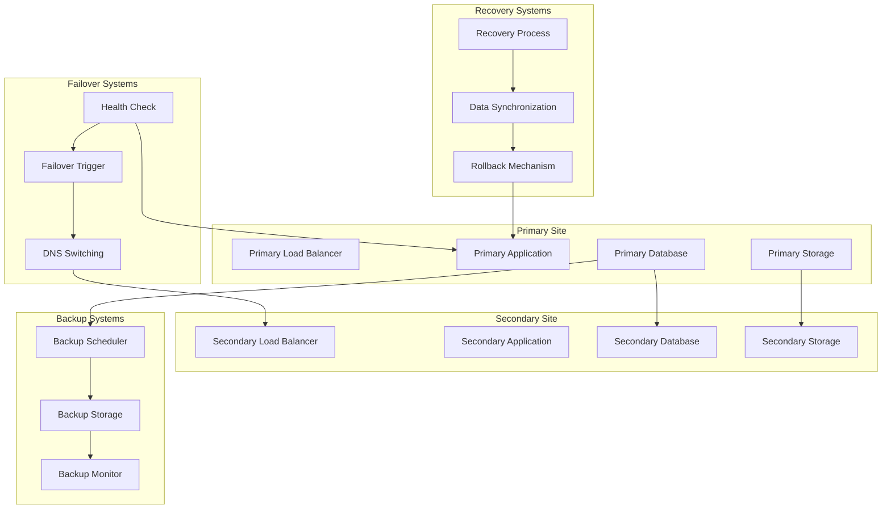

---

**文書バージョン**: 1.0  
**作成日**: 2025年8月13日  
**最終更新**: 2025年8月13日